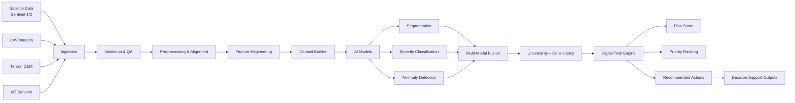
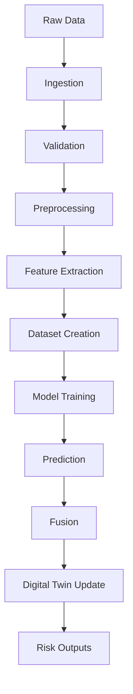

# 🌍 NewSpace Hybrid Digital Twin Platform

## A Physics-Informed Multi-Sensor AI Framework for Predictive Risk Intelligence


## 🏷️ Badges


## ⚡ Executive Overview

> A **hybrid digital twin system** that fuses **satellite, UAV, terrain, and sensor data** into a **time-evolving AI-powered risk intelligence engine**.

This platform transforms fragmented monitoring into:

* 📊 Continuous situational awareness
* 🧠 AI-driven decision intelligence
* ⚠️ Early warning for infrastructure & environmental risks


## 🎯 Problem Statement

Current monitoring systems are:

* ❌ Surface-level
* ❌ Disconnected across sensors
* ❌ Reactive instead of predictive

Critical processes like:

* slope instability
* wildfire impact propagation
* subsurface degradation

remain **undetected until failure**.


## 💡 Solution

The NewSpace platform introduces:

✔ Multi-sensor integration
✔ AI-driven feature extraction
✔ Uncertainty-aware fusion
✔ Time-aware digital twin
✔ Decision-support outputs


# 🧠 SYSTEM ARCHITECTURE




# 🔄 PIPELINE FLOW




# 🧩 CORE MODULES

| Module            | Description                    |
| ----------------- | ------------------------------ |
| **Ingestion**     | Multi-source data loading      |
| **Validation**    | Data quality checks            |
| **Preprocessing** | Alignment & cleaning           |
| **Features**      | Multi-modal feature extraction |
| **Datasets**      | Training-ready data            |
| **Models**        | AI training & inference        |
| **Fusion**        | Multi-sensor integration       |
| **Twin**          | State evolution engine         |
| **Experiments**   | Benchmarking & analysis        |
| **Outputs**       | Reports & geospatial outputs   |


# 🧠 AI COMPONENTS

* 🔍 Segmentation (burn area, defects)
* 📊 Severity Classification
* ⚠️ Anomaly Detection (sensor signals)
* 🔗 Multi-modal fusion scoring
* 📉 Calibration & uncertainty estimation

# 🔬 RESEARCH INNOVATION

### Key Contribution:

> **UM-SWRI (Uncertainty-aware Multi-Sensor Severity-Weighted Risk Index)**

This combines:

* AI predictions
* sensor signals
* temporal dynamics
* uncertainty

into a **single decision-ready metric**.


# 🔥 USE CASE: WILDFIRE DIGITAL TWIN

* Burn severity mapping
* SAR change detection
* Multi-modal risk fusion
* Temporal state tracking


# ⚙️ INSTALLATION

```bash
git clone https://github.com/civiastech/newspace-hybrid-digital-twin
cd newspace-hybrid-digital-twin

python -m venv .venv
.venv\Scripts\activate

pip install -r requirements.txt
```


# ▶️ RUN PIPELINE

```bash
python -m newspace_twin.pipeline --stage all
```


# 🧪 TESTING

```bash
pytest
```


# 📊 OUTPUTS

* 📍 GeoJSON risk maps
* 📄 CSV predictions
* 📈 Benchmark reports
* 📉 Calibration plots
* 🧠 Digital twin state logs


# 📈 PROJECT STATUS

| Component             | Status       |
| --------------------- | ------------ |
| Architecture          | ✅ Complete   |
| Training Pipeline     | ✅ Working    |
| Prediction Export     | ✅ Working    |
| Fusion System         | 🚧 Improving |
| Real Data Integration | 🚧 Ongoing   |
| Deployment            | 🔜 Planned   |


# 🧑‍💻 PROJECT LEADERSHIP

* Civil Engineer (COREN)
* AI Researcher
* Digital Twin Architect


# 🤖 ROLE OF AI

AI acts as the **core integrator**:

* learns from heterogeneous data
* bridges sensing gaps
* quantifies uncertainty
* drives decisions


# 🤝 FUNDING & COLLABORATION

We are open to:

* 🇪🇺 Horizon Europe / ERC / FCT
* 🏗 Infrastructure companies
* 🌍 Government partnerships
* 🔬 Research institutions


# 🌐 VISION

> To build a **globally scalable, intelligent digital twin system**
> for infrastructure and environmental risk management.


# ⭐ SUPPORT THE PROJECT

If you believe in this vision:

```md
⭐ Star this repo  
🍴 Fork it  
🤝 Collaborate  
```


# ⚡ FINAL STATEMENT

This is not just a repository.

> It is a **research platform for the future of intelligent infrastructure systems**.


